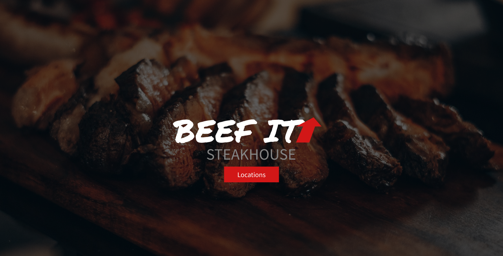
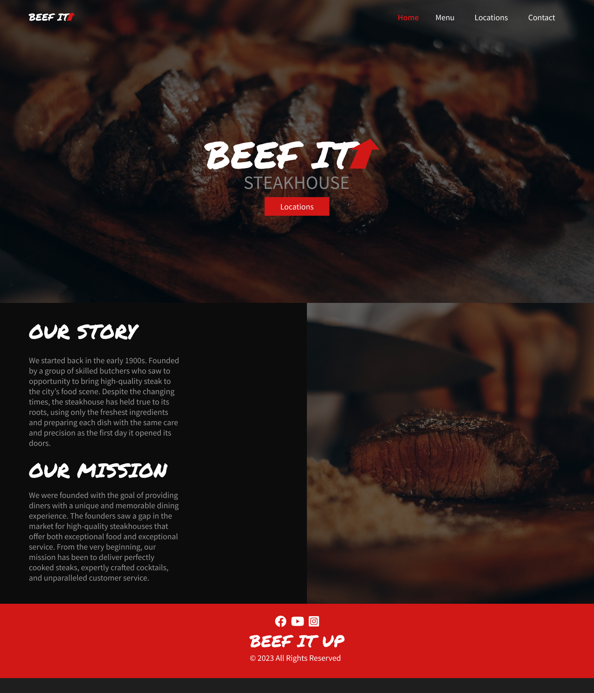
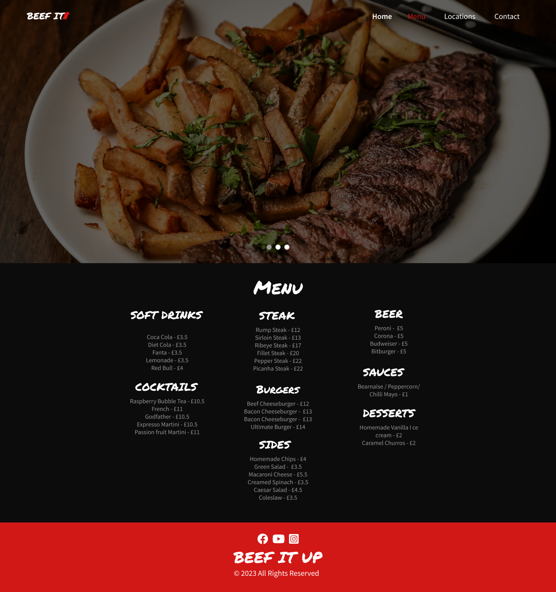
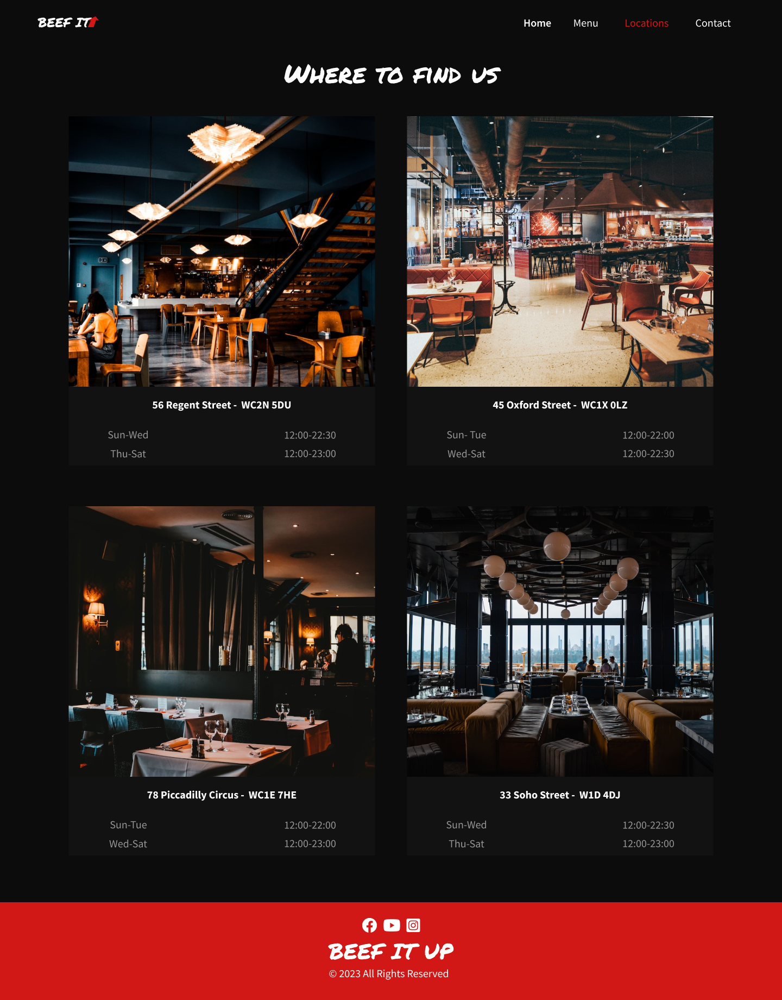
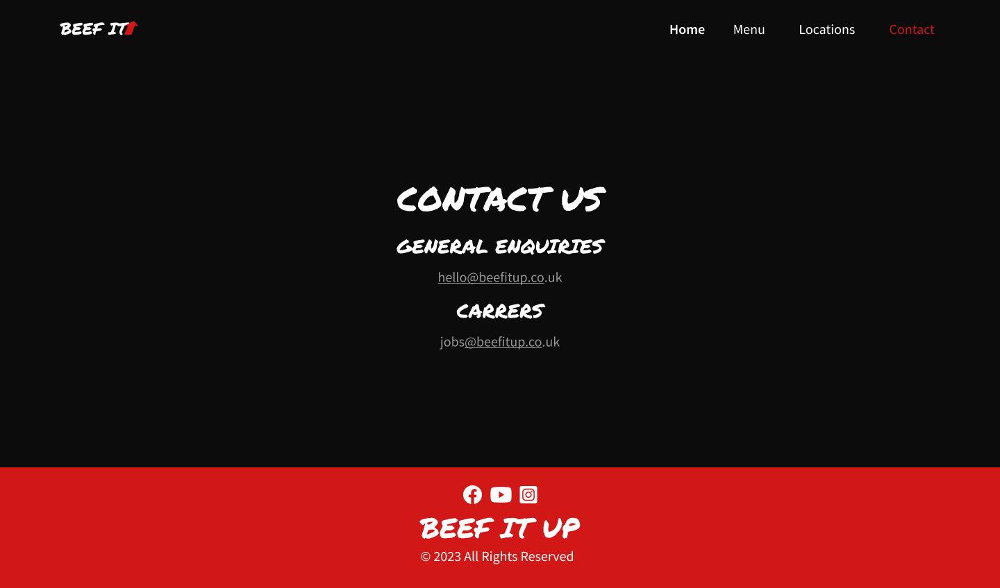

# Beef It Up Steakhouse

## Introduction
* A small Website built for a Steakhouse Restaurant with a simple but eye catching design.
* [Website Live](https://wesleyluiz21.github.io/BeefitUp-Restaurant-Project/)

## Project Goal

* The main goal is to connect and show futher information to the new and existing customers.
* Make the Restaurant look more professional and attractive for customers to attend.

### Owner's Goal

* The main goal is to catch new potential customers.
* Also, let new and current customers get information about the restaurant locations and opening times.
* Make it easier to get in touch with the restaurant.
* Make it easier to find the restaurant social media pages.

### External Goal

* The main goal is to have a website that matches both the restaurant philosophy and brand design.

## Features

## UI/UX

### Wireframes

* The Website's sketch and wireframe was created in Figma as I felt more confortable with it.
* I've decided to create a wireframe/sketch and then design the whole project with Figma.

### Design

* I've decided to make more complex wireframes with Figma, as I felt it would save me time having the entire page design ready to be built
* I tried to build the website following every page design carefully.

#### Main Page Design/Wireframe

#### Menu Page Design/Wireframe

#### Locations Page Design/Wireframe

#### Contact Page Design/Wireframe

#### Color

* The color scheme I selected was red, gray, white and black.
* There is two tons of gray, one is to the p text color and the darker one is to the Restaurant Locations card

#### Images

## Technologies

## Deployment

## Extra 