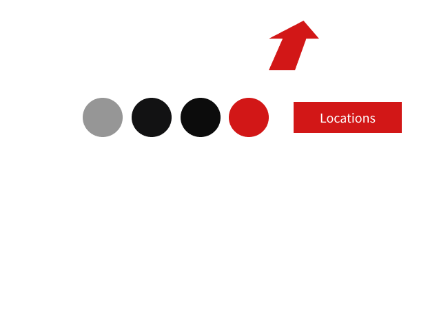

# Beef It Up Steakhouse

## Introduction
* A small Website built for a Steakhouse Restaurant with a simple but eye catching design.
* [Website Live](https://wesleyluiz21.github.io/BeefitUp-Restaurant-Project/)

## Project Goal

* The main goal is to provide a good user experience,connect and show futher information to the new and existing customers.
* Make the Restaurant look more professional and attractive for customers to attend.
* Show a bit of the Restaurant backstory to the customers

### Owner's Goal

* The main goal is to catch new potential customers.
* Also, let new and current customers get information about the restaurant locations and opening times.
* Make it easier to get in touch with the restaurant.
* Make it easier to find the restaurant social media pages.
* Show the Restaurant looks.

### External Goal

* The main goal is to have a website that matches both the restaurant philosophy and brand design.

## UI/UX

### Features

* Home Page
   * Main section with logo and a background image with 0.5 opacity.
   * About Section with some backstory and an eye catching image with 0.5 opacity.
* Menu Page
   * A Bootstrap carousel contaaining 3 images.
   * Restaurant menu section containing Foods and drinks information with prices.
   * Footer with icons, logo and copyright notice.
* Restaurant Page
   * A H1 Title.
   * Bootstrap cards containing restaurant images.
   * Locations and Opening times.
* Contact Page
   * A H1 Title.
   * two H2 Titles.
   * Email links with actual 'mail to' links that opens email when clicked.
* All pages Have:
   * Responsive design.
   * Responsive navigation bar that has a script that change color/state when the user scrolls up and down the page.
   * Footer with icons, logo and copyright notice.

### Wireframes

* The Website's sketch and wireframe was created in Figma as I felt more confortable with it.
* All sketchs were done with a Wacom Pen Tablet.
* I've decided to create a wireframe/sketch and then design the whole project with Figma.
* I've decided to not design the mobile version as I was running out of time and there is no major changes to the content.
* Both Desktop and Mobile Sketches can be found below.
* Open the image in a new tab if possible to be able to actually see the sketch image.

### Design

* I've decided to make more complex wireframes with Figma, as I felt it would save me time having the entire page design ready to be built
* I tried to build the website following every page design carefully.

#### Main Page Design/Wireframe

#### Menu Page Design/Wireframe

#### Locations Page Design/Wireframe

#### Contact Page Design/Wireframe

#### Design Choices

* I've decided the make my own logo using the matching color scheme(red and white for the text).
* I've decided to make the logo as SVG file so I could use it for both the navigation bar and Home page.

#### Color Choices

* The color scheme I selected was red, gray, white and black.
* There is two tons of gray, one is to the p text color and the darker one is to the Restaurant Locations card.
* I have added a light gray color to the p elements to diferentiate the p elements from the h1,h2... while still looking good.
* I have choose the red color to be the contrast color of the design, mainly because it is a warm color and can remind of fire/fireplaces and meat.
* I have choose the black color as the background color as it doesn't make the text hard to read while making a good match with red and white.

#### Images

* All images were taken from [Unsplash](https://unsplash.com/)
* The Unsplash Extension in Figma was very handy, making possible searching for the right images, free of copyrights.
* Then I was able to get to the image page in the Unsplash website through Figma.

#### Fonts 

* Permanent Marker - I choose this one because it gives a Restaurant Menu title feeling.(I found this font accidentally by playing with fonts in Figma/Photoshop and I felt it would fit the project design).

* Source Sans Pro - I choose this one to the general text and to have an actual normal font.

## Technologies

* HTML
   * Developed with HTML5.
* CSS3
   * Website styled with CSS3.
* Javascript (just a small script)
   * Added a small script to change the background color of the navigation bar when the user scroll up and down.
* Bootstrap 5
   * Website's structure build with Bootstrap 5.0.2 and custom css
* VS Code
   * Developed the entire Website using VS Code as I felt more confortable with it.
* Git
   * Used Git bash to push and commit code.
* Github
   * Used to host the source code and Git Pages to deploy the website. 
* Font Awesome
   * Used Font Awesome library to add the social media icons and the hamburger navigation icon.
* Google Fonts API
   * Used to select the fonts I've choosen for the project.
* Figma
   * Used to sketch, wireframe and design the whole project.
* Figma Unsplash Extension
   * Used to obtain high quality images free of copyrights to the project.

## Deployment

### Overall

* I was supposed to use Gitpod for this project, however I have decided to use the desktop VS Code as I'm very familiar with it and I felt like Gitpod would slow me down.
* Totally created using Visual Studio code as I stated above.

### 

## Bugs 

* The initial plan was to use Bootstrap 6, however I had to go back to bootstrap 5 as I been struggling to make things work and I felt like it was a better choice overall.
* At first, in the process of creating the navigation bar with bootstrap, the code wasn't behaving the way it was supposed to be.
  * Fixed by reading the bootstrap 5 documentation carefully and decided to use the bootstrap navigation template.

## Testing

### Lighthouse Chrome Testing
* The results for each page are presented below.
 
 #### Main Page
 

 #### Menu Page
 

 #### Locations Page
 

  #### Contact Page
 

### Devices Used:

* Google Pixel 6
* Desktop (1920x1080)
* Desktop (2 monitors/4k resolution)
* Laptop (1366x768)

### Validators

*  [HTML W3C Validator](https://validator.w3.org/)
   * Found a semicolon missing in the footer copyright symbol - fixed
   * Found a single double quotes in the code that had no purpose - fixed
   * Found a section tag in the menu page without closing tag - fixed
   * Found two closing div tags in the menu page that had no purpose - fixed
   * After fixing the above bugs/errors, there were no more errors found.

   #### Main Page 
   

   #### Menu Page
   

   #### Locations Page
   

   #### Contact Page
   

*  [CSS W3C Validator](https://jigsaw.w3.org/css-validator//)
   * No errors found.
   

## Credits

  ### Pictures

  * Pictures taken from [Unsplash](https://unsplash.com/)
  * [Home Page Picture](https://unsplash.com/photos/cpkPJ-U9eUM) - Author: Emerson Vieira.
  * [About Section Picture](https://unsplash.com/photos/lanootd2FcU) - Author: Emerson Vieira.
  * [1st Carousel Picture](https://unsplash.com/photos/pe9dvM1rQkM) - Author: Tim Toomey.
  * [2nd Carousel Picture](https://unsplash.com/photos/RO6Ke69Szhg) - Author: Emerson Vieira.
  * [3rd Carousel Picture](https://unsplash.com/photos/lanootd2FcU) - Author: Emerson Vieira. (same as the about section picture)
  * [1st Restaurant Picture](https://unsplash.com/photos/1H30uRC1plc) - Author: Volkan Vardar.
  * [2nd Restaurant Picture](https://unsplash.com/photos/Ciqxn7FE4vE) - Author: Nick Karvounis.
  * [3rd Restaurant Picture](https://unsplash.com/photos/ZgREXhl8ER0) - Author: Adrien Olichon.
  * [4th Restaurant Picture](https://unsplash.com/photos/WWST6E8LxeE) - Author: Paul Griffin.

  ### Code Related

  * Stackoverflow and Bootstrap 5 documentation were used to solve all issues/bugs.
  * ChatGPT(or OpenIA) was used to generate random adresses in central london and restaurant description/about/goal in the About Section and then tweaked to fit the website/design(It was quite handy!).
  * CSS Prefixes code were taken from the [Autoprefixer](https://autoprefixer.github.io/) website.
  * Template code for the carousel section taken from the Bootstrap 5 documentation and tweaked to suit the site needs.

## Extra 